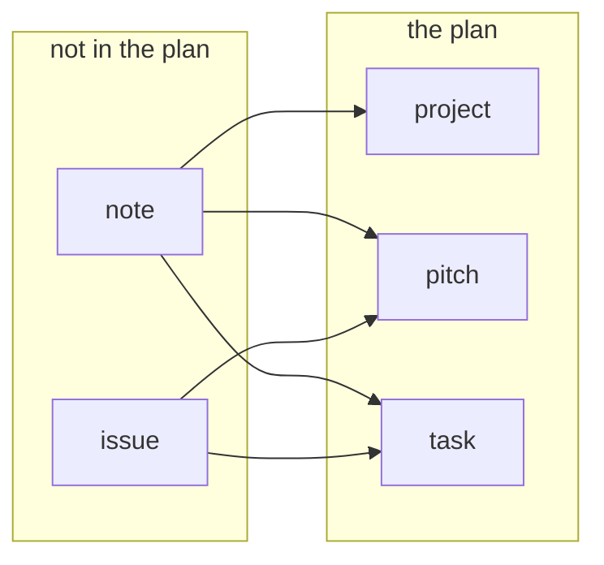

# The data model

One markdown file per record: YAML frontmatter, then the shaping document as the body. Git is the
database — every write is one commit through `store.py` against a bare repository, from the editor,
from `/api/record`, or from somebody with a terminal — so everything here is either a field in a file
or something derived from the files, and **nothing derived is ever written back**. `architecture.md`
has the pages these structures are drawn on; this file is the structures.

## One type, six kinds

There is one record type. `Record` (`model.py`) carries what every kind shares — `id`, `kind`,
`title`, `parent`, `status`, `owner`, `assignees`, `reviewers`, `review_waived`, `assigned_on`,
`priority`, `depends_on`, `cycle`, `tags`, `prs`, `body`, `created_schema_version` — and `kind` says
which rung it is on. The six rungs are subclasses that add fields. They are not six different things:
one model, one parser, one write path, one page.

| kind | id | files | filed under | in the plan | fields it adds |
|---|---|---|---|---|---|
| `product` | `prod-a3f81c` | `products/` | — | yes | none |
| `project` | `proj-…` | `projects/` | `product` | yes | none |
| `pitch` | `pitch-…` | `pitches/` | `project` | yes | `person_weeks`, `shaped_by` |
| `task` | `task-…` | `tasks/` | `pitch`, `project` | yes | `person_weeks` |
| `issue` | `issue-…` | `issues/` | — | no | `reported_by`, `opened_on`, `pitched_into` |
| `note` | `note-…` | `notes/` | — | no | `written_by`, `written_on`, `became` |

That table is not prose about the code. It **is** `KINDS` in `model.py` — a tuple of `Rung`, coarsest
first — with a few of its columns left out here: whether the scheduler dates the kind, whether it may
wait on anything, whether it carries an appetite, whether a hover shows its document, which words its
`status` may take, and which field answers "who is behind this". Everything else is derived from that
tuple: the directories the loader walks, the id pattern (a rung's prefix and six hex digits), the
parent rules, the filter menus, the create form, and `unread_fields`, which is how a form declines to
offer a box the validator would then complain about. A seventh kind is a row, not a search for the
places `project` was written down.

A field the rung does not read is reported beside the record rather than refused — a blocker where it
changes what the plan means (`depends_on` on a product is a dependency nobody will schedule,
`person_weeks` on a note an appetite nobody will read) and a warning where the field is merely
ignored.

Each kind is one thing and says so:

- A **pitch** is the unit of the bet: what the betting table offers, what carries an appetite and a
  `shaped_by`, and the only kind whose body the shaping hints read.
- A **task** is a piece of a pitch. It has its own size and its own people and takes its cycle from
  the pitch — a bet is made once, on the thing the room named. A task with **no** parent is a chore
  nobody pitched: bettable in its own right, and then the cycle is its own.
- A **project** groups pitches. No size, no capacity, never bet; its span is the rollup of what is
  inside it.
- A **product** is a codebase and a container for projects. gt4py is the DSL under icon4py, dace is a
  backend, and work in one waits on work in another — which is why one plan holds all of them:
  separate plans cannot express a cross-product dependency, and one the tool cannot express is one
  somebody tracks in their head. Container and nothing else: no status, no PRs, no appetite, never
  scheduled, waits on nothing, and a dashed outline rather than a filled box on the graph.
- An **issue** is something existing that is broken, before anybody has decided to do it. It has no
  `shaping` status, because a shaped issue is a pitch: somebody reads the open issues at the betting
  table and writes one, and that is the whole lifecycle.
- A **note** is the second inbox, and one sentence pays for having two:

  > an issue is "we found something existing that is broken", a note is "we are thinking of creating
  > something that does not exist and our ideas are confused".

  A note is therefore not a pitch in `shaping`, which is what it most looks like from a distance: a
  pitch presupposes you know what you are shaping, and a note precedes the problem, the solution and
  the appetite alike. It has no appetite, owner, size, cycle or dependencies, and exactly two written
  statuses — `thinking` and `dropped`, plus `promoted`, which is derived. No `in_progress` (the
  moment there is work there is a record that is work), no `ready` ("ready to be shaped" is a promise
  the Promote button keeps in one press), no `done` (a note is not finished, it is answered).

`product ← project ← pitch ← task` is enforced, not just documented: a parent of the wrong kind is a
blocker for anything written since the rule existed and a warning for everything older.

**Status is a written field; state is what a record actually is.** `Record.state()` returns the
status; `Issue.state` derives `in_progress` and `done` from what the issue was pitched into, and
`Note.state` derives `promoted` from `became`. Derived for the reason `blocks` is: a copy stored
beside the link goes stale the first time somebody closes the pitch.

**A plan directory is flat.** `products/`, `projects/`, `pitches/`, `tasks/`, `cycles/`, `issues/`,
`notes/` and `people/` hold one file per record and nothing below them, because every reader takes an
identity off the filename. `people/team/ann.md` is not a record filed tidily — it is a second `ann`,
visible to half the application. `record_paths_in` is the one place that decides this, for the server
reading a tree at a commit and for the CLI globbing a disk, and a file below a plan directory is
named on every page and by `openproj check` with the move that fixes it.

## Two populations: `Index.records` and `Index.plan`

`build_index` (`index.py`) turns the parsed files into one in-memory `Index`, which holds the same
records twice under two names because two questions are asked of them. `records` is everything that
parsed, whatever its kind: the landing list, the detail lookup and the delete cascade read it,
because those must resolve an id that may name an issue or a note. `plan` is the kinds whose rung
says `planned`, and every PM surface — table, graph, timeline, people, scheduler, facets,
`/api/index.json` — reads that.

One distinction, not two attributes. The narrowing happens in one comprehension and a
`model_validator` on `Index` refuses a `plan` holding an unplanned kind, which is why this is a
narrowing rather than an exclusion written into each page: a consumer nobody edits stays correct, and
one somebody forgets **fails closed** — it sees fewer records, never an issue on the timeline.
`plan ⊂ records`, so the total map is always the safe door, and each name states its population on
the line that uses it.

Everything else on the `Index` is derived from those records and the config:

| field | what it holds |
|---|---|
| `children` | parent id to child ids, total over `records` |
| `blocked_by` / `blocks` | `depends_on` and its reverse; edges to records that do not exist are dropped from both at once |
| `spans` | `Span` per record from `schedule.py` — `start`, `end`, and flags for estimated, unowned, historical, unscheduled, and weeks past the cycle's build |
| `explanations` | `Explanation` per record: why the scheduler placed it there, and what it waited on |
| `progress` | `Progress` per plan record — `done`/`total` in weeks from child tasks, or in items from the body's checklist, never both |
| `problems` | `Problem` per finding, each carrying the `schema_version` that introduced its rule |
| `unreadable` | `Unreadable` per plan file that is not a record, with the reason in one line |
| `facets`, `for_later` | what the filter menus offer, and which bodies keep a `## For later` — both plan facts, because a dead option on the table is a filter that can select nothing |
| `search_blob` | what the search box matches, over every record: one missing from it is one its own page cannot find |
| `cycles`, `plans`, `holidays`, `known_people`, `icons`, `today` | carried so a renderer needs nothing but the index |

## Promotion

**An inbox that cannot become work is a second inbox nobody empties.** `POST /api/promote` is the one
door out of both, and `render.PROMOTABLE` is the graph:

- **The source survives** — it is the only record of the thinking that led to the bet — and gains
  `became`, or `pitched_into` on an issue: one direction, on the record where the decision was made,
  the same rule `depends_on` follows.
- **The new record says where it came from in its own document**, in prose, above everything. Not a
  field: a `from_note` on every planned kind would put a note id into the rows the table, the graph
  and the timeline are built from. So "where did this pitch come from" is answerable from the pitch
  alone, in `git show`, with no index and no server.
- **One commit**, because it is one decision. Both files go through `Store.write_all`, each
  compared-and-swapped on its own path; as two commits the second can fail after the first has landed
  and leave a pitch nothing points at.
- **Title, tags and body cross, and nothing else.** The new record is created in `shaping`, the one
  status whose required-field gate is empty, so a promotion always produces a record that validates
  without inventing an owner, a size or a cycle nobody agreed to. Its body is the kind's template with
  the source's text under `## Problem`, which is what that heading asks for.

## Sizes, dependencies, requiredness

A size is `person_weeks` on a pitch and on a task — the work one person would need — and the people on
it divide it, each at their own availability, so adding a second name halves the elapsed time. A pitch
with tasks takes its dates and its capacity from them, which makes its own appetite the **bet**: what
the room agreed to spend, kept as written. Where the tasks add up to more, the page says so and
`openproj check` warns; cutting scope or re-betting is a person's decision, so nothing refuses the save.

Only `depends_on` is stored, on the dependent. Any kind may block any kind — a task may wait on a
whole pitch — and an edge written on a pitch is inherited by everything inside it, so the edge stays
written once where somebody wrote it. The one forbidden direction is your own containment chain:
containment already requires a child before its parent, so a dependency along it demands to be both
before and after itself.

Requiredness is **status-gated**, lives in `validate_all`, and is enforced in the create form,
`openproj check` and the index gate. The five statuses a project, pitch or task moves through are
`shaping`, `ready`, `in_progress`, `done`, `shelved`, in that order; priority is one of `very_high`,
`high`, `medium`, `low`, `very_low` — five rungs, because three left the team writing `High+` in the
margin of its own table.

| status | additionally required |
|---|---|
| `shaping` | nothing — an idea nobody has bet on has no owner and no size by definition |
| `ready` | `owner`; a reviewer or `review_waived`; a size; `shaped_by` on a pitch |
| `in_progress` | `assigned_on`; a reviewer who is not the owner |
| `done` | at least one PR |
| `shelved` | nothing — parked work is not broken work |

**Parse permissively, validate strictly.** Every field is optional at the type level and `status` and
`priority` are plain `str`, so a hand-edited file with a missing field or a retired word still loads
and reports a problem instead of taking the index down. Only `kind` is strict: an unknown kind has no
directory, no id prefix, no parent rule and no model, so there is nothing to draw it as.

**Grandfathering.** Each rule records the `schema_version` that introduced it and a record is blocked
only by rules that existed when it was created; a newer rule warns. Without it, adding one required
field invalidates the whole corpus at once and the rule gets reverted rather than adopted. `shaped_by`
is the live example.

## The structures that are not records

**`Cycle`** — `cycles/<n>.md`, frontmatter and a body like a record, but not on the ladder: it has no
id, no kind, and lives in `Config.plans` rather than in `Index.records`. It stores **two dates, and
both are meetings**: `starts_on` is the betting table and the first day of build, `reviews_on` is the
review meeting, which is also the brainstorm for the next cycle. Beside them sit an `availability`
fraction per person, a `goal` the betting table settles, and a body for what came up. Everything else
— where build ends, how many **working** weeks it holds with the holidays taken out, where the
cool-down ends — is derived by `Config.with_plans`, and a date the tool had to assume is marked as
assumed on the page rather than printed as though somebody had chosen it. Lengths were stored
instead, and a length is a prediction of a date somebody picks: it cannot know that a review moved
for a conference, or that a cycle over the ETH closure holds a fortnight of building rather than
four weeks — and since `capacity = availability × build weeks`, that last one was the betting table's
own number being wrong.

A record's `cycle:` records **where a bet was made** and is never re-stamped, so an overrun keeps
accusing. It lives on the thing that was bet, everything under a pitch takes the pitch's, and a
project therefore has no cycle at all.

**`Person`** — `people/<login>.md`, holding what one person chose for themselves (today, `icon`: the
name of a drawing, not the drawing). **The login is the filename and is not a field**: every other
record carries its id in the frontmatter because other records point at it, and nothing points at a
person, so a second copy would only give the two halves of the app something to disagree about. Its
body is not a field either — nothing reads it, no page offers a box for it, and a save hands it back
byte for byte. A file each rather than a map in the config, because `store.write` merges frontmatter
key-by-key and line-merges the prose below it: whole-file YAML through that turns two edits nobody
would call a disagreement into text that is not YAML, and two people picking an icon at once write
two different paths, where compare-and-swap is scoped.

**`Config`** — `config/*.yaml`: `schema_version` (the version new records are created at, not
necessarily the corpus's), `nominal_availability`, `default_task_effort`, `cooldown_weeks`,
`holidays`, the cycle windows, and `known_people`, the **roster**. Empty means the check is off, which
is the right default; when it does name people, an owner, assignee, reviewer or shaper who is not on
it is a warning and never a blocker, because the roster is maintained by hand and a new colleague must
not be unassignable on their first day. It carries `plans` and `people` too, loaded from the record
files rather than from any config file — the roster and a person's own record answer different
questions and neither validates the other.

**`Problem` and `Unreadable`** — a `Problem` is keyed by record id, so every page hangs it on that
record's row. An `Unreadable` is keyed by a path, deliberately not a `Problem`: a file that will not
parse has no record, which is precisely what is wrong with it, and keying one to a record would add to
a count whose filter can never show it.

## The body

The body of a pitch is prose and stays prose. Nothing validates it, rewrites it or requires a word of
it — but two headings are read, because the team's own template already asks for them:

- **`## Progress`** — a task list, which is a *task's* business. A pitch's progress is its tasks, each
  ticked from its own `status` and weighted by its size, so `4/7.5 wk` is four weeks of a
  seven-and-a-half-week bet rather than a count of rows. A pitch with no tasks yet has its own list
  counted; one that keeps both is told which the page is reading. Counted, never written: a checkbox
  stored beside a task's status is the same stale copy `blocks` would be.
- **`## For later`** — deferred scope. The only record the plan keeps of a bet trimmed to fit its
  appetite, and it was invisible until it had a name.

A missing `## Rabbit holes` or `## No-gos` on a live pitch prints a note on that pitch's page and
nowhere else — never in `openproj check`, never in CI, never blocking a save. A validator with an
opinion about prose is one people route around.

Creating a record starts from the team's own template, guidance in HTML comments exactly as HackMD
carries it, stripped when the page renders — so a pitch drafted in either place is the same document.
The three header lines of the HackMD template (`Shaped by`, `Appetite`, `Developers`) are fields here
instead: a heading restating a field is the two-copies-of-one-fact problem this tool exists to end.

🤖 Written by an agent on behalf of @jcanton
