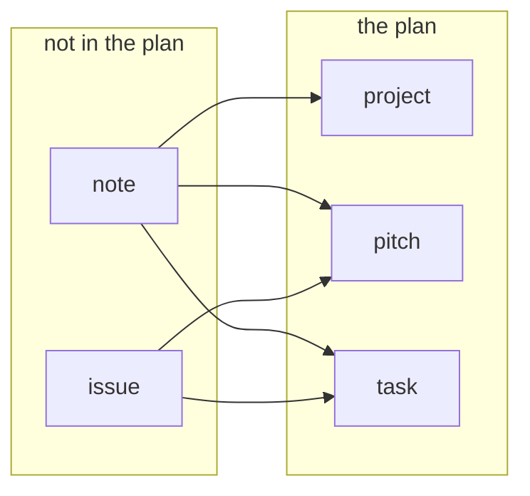

# The data model

One markdown file per record: YAML frontmatter, then the body. Git is the
database — every write is one commit through `store.py` against a bare repository, from the editor,
from `/api/record`, or from somebody with a terminal — so everything here is either a field in a file
or something derived from the files, and **nothing derived is ever written back**. `architecture.md`
has the pages these structures are drawn on; this file is the structures.

## One type, six kinds

There is one record type. `Record` (`model.py`) carries what every kind shares — `id`, `kind`,
`title`, `parent`, `status`, `owner`, `assignees`, `reviewers`, `review_waived`, `start_date`,
`priority`, `depends_on`, `cycle`, `tags`, `prs`, `body` — and `kind` says which rung it is on. The
six rungs are subclasses that add fields. They are not six different things: one model, one parser,
one write path, one page.

| kind      | id        | files       | filed under        | in the plan | fields it adds                             |
| --------- | --------- | ----------- | ------------------ | ----------- | ------------------------------------------ |
| `product` | `prod-_`  | `products/` | —                  | yes         | none                                       |
| `project` | `proj-…`  | `projects/` | `product`          | yes         | none                                       |
| `pitch`   | `pitch-…` | `pitches/`  | `project`          | yes         | `person_weeks`                             |
| `task`    | `task-…`  | `tasks/`    | `pitch`, `project` | yes         | `person_weeks`                             |
| `issue`   | `issue-…` | `issues/`   | —                  | no          | `reported_by`, `opened_on`, `pitched_into` |
| `note`    | `note-…`  | `notes/`    | —                  | no          | `written_by`, `written_on`, `became`       |

That table is not prose about the code. It **is** `KINDS` in `model.py`, and everything else is
derived from it: the directories the loader walks, the id pattern, the parent rules, the filter
menus, and the create form. A seventh kind is a row, not a search for the places `project` was
written down.

Each kind is one thing and says so:

- A **pitch** is the unit of the bet: what the betting table offers, and the only kind whose body the
  shaping hints read. Its `owner` is who shaped it and holds it — there is no `shaped_by` field;
  `assignees` build it, `reviewers` read the PR.

- A **task** is a piece of a pitch, with its own size and its own people, taking its cycle from the
  pitch. A task with **no** parent is a chore nobody pitched: bettable in its own right.

- A **project** groups pitches. No size, no capacity, never bet; its span is the rollup.

- A **product** is a codebase and a container for projects. Work in one waits on work in another,
  which is why one plan holds all of them: separate plans cannot express a cross-product dependency.
  Container and nothing else — no status, no PRs, no appetite, never scheduled.

- An **issue** is something existing that is broken, before anybody has decided to fix it. No
  `shaping` status, because a shaped issue is a pitch.

- A **note** is the second inbox, and one sentence pays for having two:

  > an issue is "we found something existing that is broken", a note is "we are thinking of creating
  > something that does not exist and our ideas are confused".

  A note is therefore not a pitch in `shaping`: a pitch presupposes you know what you are shaping.
  Two written statuses, `thinking` and `dropped`, plus `promoted`, which is derived.

`product ← project ← pitch ← task` is enforced, not just documented: a parent of the wrong kind is a
blocker for anything written since the rule existed and a warning for everything older.

**Status is a written field; state is what a record actually is.** An issue derives `in_progress` and
`done` from what it was pitched into, and a note derives `promoted` from `became` — derived for the
reason `blocks` is: a copy stored beside the link goes stale the first time somebody closes the
pitch.

**A plan directory is flat.** `products/`, `projects/`, `pitches/`, `tasks/`, `cycles/`, `issues/`,
`notes/` and `people/` hold one file per record and nothing below them, because every reader takes an
identity off the filename: `people/team/ann.md` is a second `ann`. A file below a plan directory is
named on every page and by `openproj check`, with the move that fixes it.

## Two populations: `Index.records` and `Index.plan`

`build_index` (`index.py`) turns the parsed files into one in-memory `Index`, holding the same
records twice under two names because two questions are asked of them. `records` is everything that
parsed, whatever its kind — the landing list, the detail lookup and the delete cascade read it,
because those must resolve an id that may name an issue or a note. `plan` is the kinds whose rung
says `planned`, and every PM surface reads that. A validator refuses a `plan` holding an unplanned
kind, so a consumer somebody forgets **fails closed**: it sees fewer records, never an issue on the
timeline.

## Promotion

**An inbox that cannot become work is a second inbox nobody empties.** `POST /api/promote` is the one
door out of both:

- **The source survives** — it is the only record of the thinking that led to the bet — and gains
  `became`, or `pitched_into` on an issue.
- **The new record says where it came from in its own document**, in prose and not in a field.
- **One commit**, because it is one decision. As two, the second can fail after the first has landed
  and leave a pitch nothing points at.
- **Title, tags and body cross, and nothing else.** The new record is created in `shaping`, the one
  status whose required-field gate is empty, so a promotion always validates without inventing an
  owner, a size or a cycle nobody agreed to.

## Sizes, dependencies, requiredness

A size is `person_weeks` on a pitch and on a task, and the people on it divide it, each at their own
availability. **There is no default.** A record nobody has sized is not scheduled, weighs nothing in
its parent's progress and charges nobody's capacity, and every page that adds weeks up says how many
records it could not count — a number the tool invented is a number that arrives everywhere looking
like one somebody estimated. Shaping and thinking work is unsized by definition and stays that way;
`ready` and `in_progress` both demand a size. A pitch with tasks takes its dates and its capacity
from them, which makes its own appetite the **bet**: what the room agreed to spend, kept as written.
The comparison against it is calendar against calendar — the bet over the people on it is a number
of weeks, and the tasks' own rolled-up span is another — so a bet that holds the work as effort can
still fail to hold it as time, when one person has to do two things in turn. Where the tasks do not
fit, the page says so and `openproj check` warns; nothing refuses the save, and neither a pitch nor
a cycle over its capacity is ever a CI failure.

Only `depends_on` is stored, on the dependent. Any kind may block any kind, and an edge written on a
pitch is inherited by everything inside it. The one forbidden direction is your own containment
chain: a dependency along it demands to be both before and after itself.

Requiredness is **status-gated**, lives in `validate_all`, and is enforced in the create form,
`openproj check` and the index gate. `quickstart.md` has the table of what each status requires.
Priority is one of `very_high`, `high`, `medium`, `low`, `very_low` — five rungs, because three left
the team writing `High+` in the margin of its own table.

**A reviewer is named when the bet is made, not when a PR appears**: a bet nobody will review is a
bet that should not be made. `review_waived` is a deliberate act, for work with nothing to review,
and it is a facet and a count, so a team that waives everything sees itself doing it. **A reviewer is
not a worker**: review is never charged against capacity.

**Parse permissively, validate strictly, and grandfather.** Every field is optional at the type level
and `status` and `priority` are plain `str`, so a hand-edited file with a missing field or a retired
word still loads and reports a problem instead of taking the index down; only `kind` is strict. Each
rule also records the `schema_version` that introduced it, and a record is blocked only by rules that
existed when it was created — without that, one new required field invalidates the whole corpus at
once.

## The structures that are not records

**`Cycle`** — `cycles/<n>.md`, frontmatter and a body like a record, but not on the ladder: no id, no
kind, and it lives in `Config.plans`. It stores **two dates, and both are meetings**: `starts_on` is
the betting table and the first day of build, `reviews_on` is the review. Beside them sit an
`availability` fraction per person, a `goal`, and a body for what came up. Everything else — where
build ends, how many **working** weeks it holds with the holidays taken out, where cool-down ends —
is derived, and a date the tool had to assume is marked as assumed.

A record's `cycle:` records **where a bet was made** and is never re-stamped, so an overrun keeps
accusing. Everything under a pitch takes the pitch's, and a project therefore has no cycle at all.

**`Person`** — `people/<login>.md`, holding what one person chose for themselves. **The login is the
filename and is not a field**: nothing points at a person, so a second copy would only give the two
halves of the app something to disagree about.

**`Config`** — `config/*.yaml`: `schema_version`, `nominal_availability`, `cooldown_weeks`,
`holidays`, the cycle windows, and `known_people`, the **roster**. Empty means the
check is off; when it does name people, somebody who is not on it is a warning and never a blocker.

**`Problem` and `Unreadable`** — a `Problem` is keyed by record id, so every page hangs it on that
record's row. An `Unreadable` is keyed by a path: a file that will not parse has no record, which is
precisely what is wrong with it.
